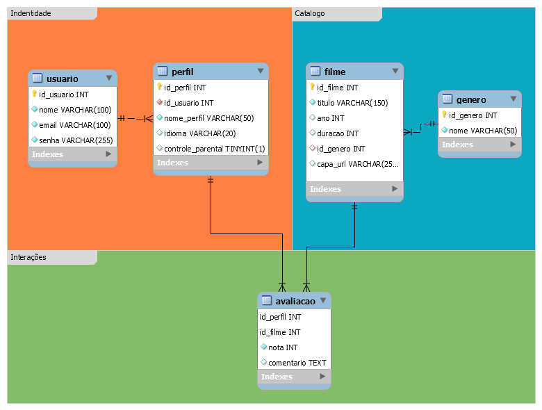

# Capítulo X – Modelagem e Implementação do Banco de Dados

## 1. Introdução

O banco de dados do sistema foi projetado para armazenar informações de usuários, perfis, filmes, gêneros e avaliações, seguindo a **modelagem conceitual previamente definida no DER (Diagrama Entidade-Relacionamento)**.
A implementação foi realizada no **MySQL**, utilizando comandos da **Data Definition Language (DDL)** para criar tabelas, definir restrições e relacionamentos.

---

## 2. Modelo Conceitual – DER

### 2.1 Diagrama Entidade-Relacionamento

